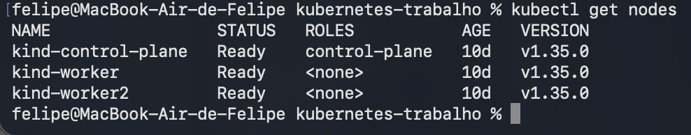
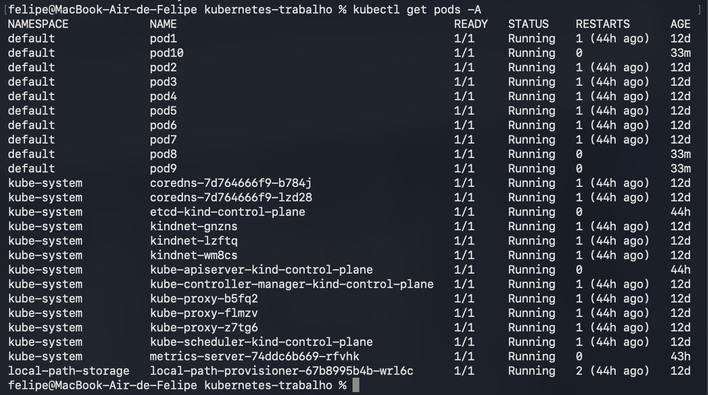
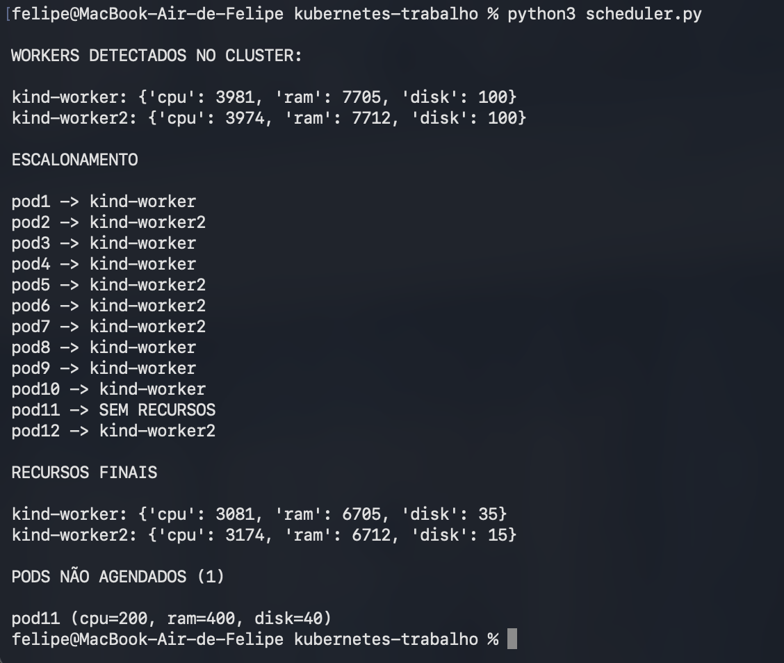
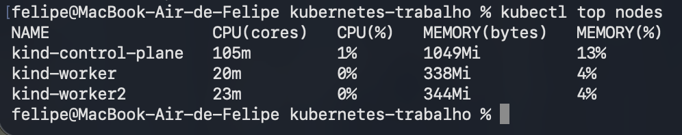
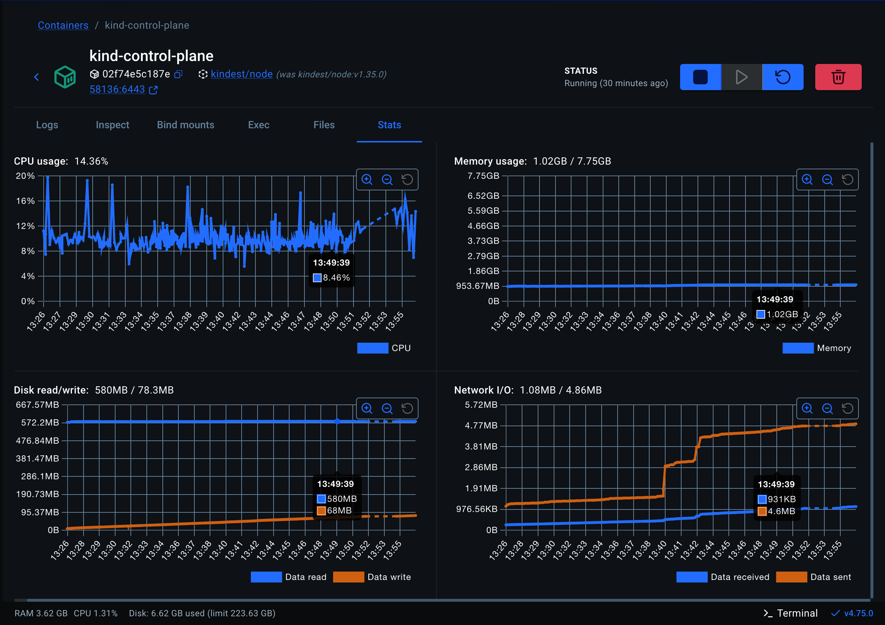
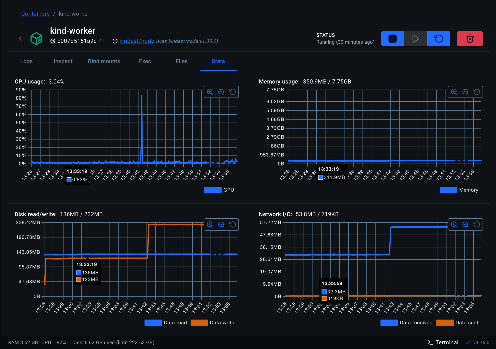
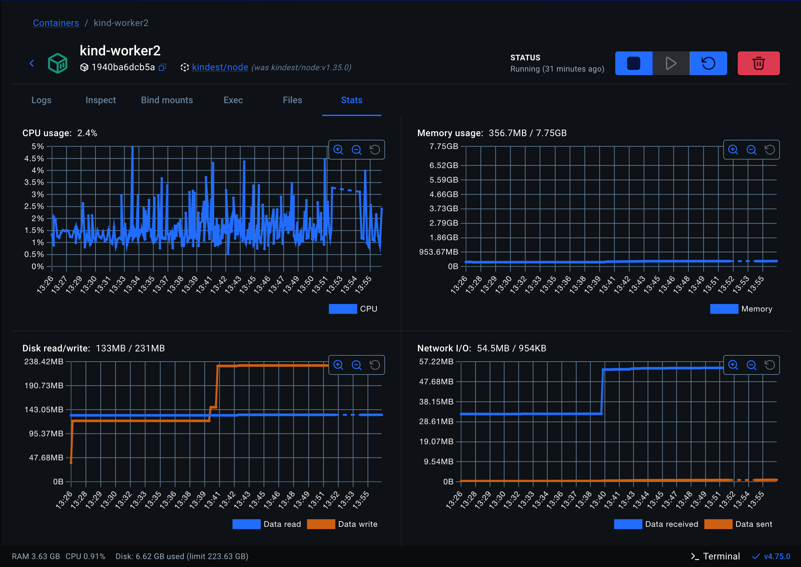

# Kubernetes Scheduler

Projeto acadêmico para simular um escalonador distribuído em Kubernetes usando Python.

---

# Objetivo

O projeto simula o funcionamento de um scheduler distribuído que:

- coleta recursos disponíveis dos nós do cluster
- distribui tarefas entre os workers
- calcula uso de CPU
- calcula uso de memória RAM
- calcula uso de disco
- mostra o estado final dos nós após a execução

Toda a execução acontece em um cluster Kubernetes local criado com Kind.

---

# Tecnologias utilizadas

- Python 3
- Kubernetes
- Kind
- Docker Desktop
- Metrics Server
- kubectl

---

# Estrutura do cluster

Cluster criado com 3 nós:

- 1 Control Plane
- 2 Worker Nodes

---

# Execução do projeto

## Criar cluster

```bash
kind create cluster --config config.yaml
```

---

## Verificar nodes

```bash
kubectl get nodes
```

### Resultado:



---

## Verificar pods

```bash
kubectl get pods -o wide
```

### Resultado:



---

## Executar scheduler

```bash
python3 scheduler.py
```

### Resultado:



---

## Coleta de métricas do Kubernetes

```bash
kubectl top nodes
```

### Resultado:



---

# Docker Desktop - Containers do Cluster

Visualização dos containers criados pelo Kind:

- kind-control-plane
- kind-worker
- kind-worker2

### Resultado:


---

# Métricas dos nós

## Control Plane



---

## Worker 1



---

## Worker 2



---

# Exemplo de saída final do scheduler

```text
RECURSOS INICIAIS

kind-worker {'cpu': 2, 'ram': 8, 'disk': 200}
kind-worker2 {'cpu': 2, 'ram': 8, 'disk': 200}

Executando tarefa-1...
Executando tarefa-2...
Executando tarefa-3...

RECURSOS FINAIS

kind-worker {'cpu': 0, 'ram': 6, 'disk': 20}
kind-worker2 {'cpu': 0, 'ram': 4, 'disk': 165}
```

